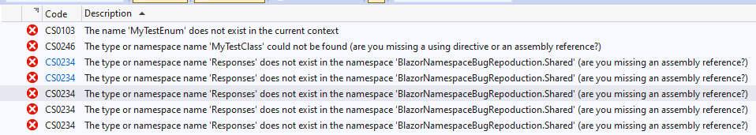
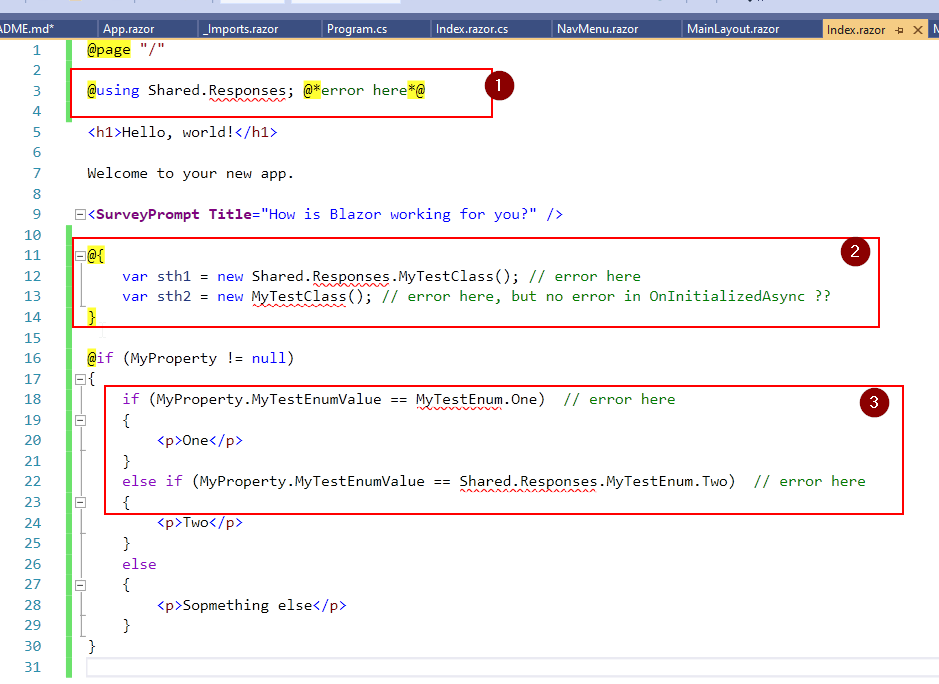
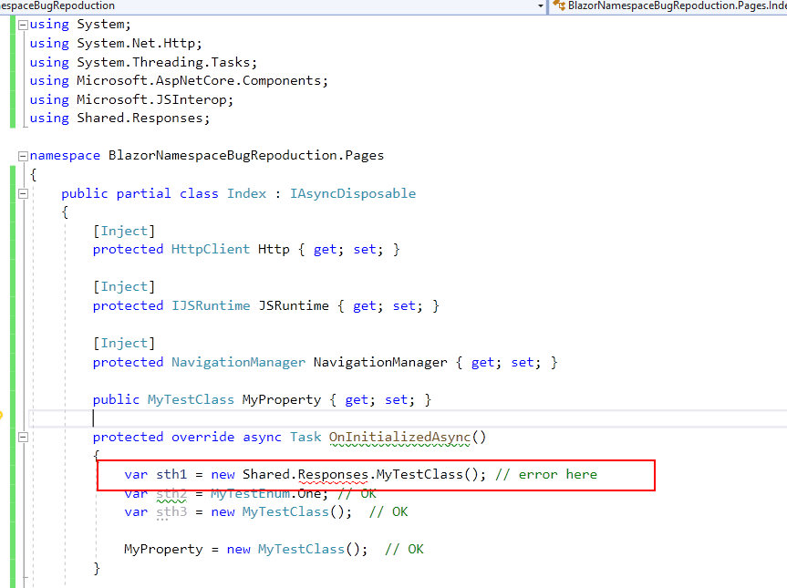
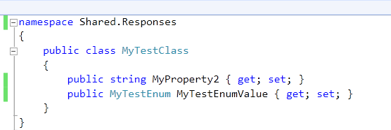
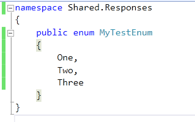

# Blazor WASM: enum comparison broken and namespace is not visible

An example of compilation problems in blazor.



Date reported: 
- 02.10.2021 15:00 CET

Issue tracking: 
- https://github.com/dotnet/aspnetcore/issues/37218

## Resolution

- [ ] bug
- [ ] feature
- [ ] other

Comment:
- TBD

# Issues

## Issue 1, 2, 3:

1. cannot reference namespace in razor page
2. cannot init class either explicitly or implicitly  in razor page
3. cannot compare enums in razor page (neither explicitly or implicitly)



## Issue 4:

Cannot explicitly init a class:



Proof that class exists in namespace:

`Shared.Responses.MyTestClass`



`Shared.Responses.MyTestEnum`



# Specs

1. Blazor WASM
2. ASP.NET Core 5
2. `dotnet --info`

```
.NET SDK (reflecting any global.json):
 Version:   5.0.401
 Commit:    4bef5f3dbf

Runtime Environment:
 OS Name:     Windows
 OS Version:  10.0.19042
 OS Platform: Windows
 RID:         win10-x64
 Base Path:   C:\Program Files\dotnet\sdk\5.0.401\

Host (useful for support):
  Version: 5.0.10
  Commit:  e1825b4928

.NET SDKs installed:
  3.1.413 [C:\Program Files\dotnet\sdk]
  5.0.102 [C:\Program Files\dotnet\sdk]
  5.0.104 [C:\Program Files\dotnet\sdk]
  5.0.401 [C:\Program Files\dotnet\sdk]

.NET runtimes installed:
  Microsoft.AspNetCore.All 2.1.24 [C:\Program Files\dotnet\shared\Microsoft.AspNetCore.All]
  Microsoft.AspNetCore.All 2.1.28 [C:\Program Files\dotnet\shared\Microsoft.AspNetCore.All]
  Microsoft.AspNetCore.All 2.1.30 [C:\Program Files\dotnet\shared\Microsoft.AspNetCore.All]
  Microsoft.AspNetCore.App 2.1.24 [C:\Program Files\dotnet\shared\Microsoft.AspNetCore.App]
  Microsoft.AspNetCore.App 2.1.28 [C:\Program Files\dotnet\shared\Microsoft.AspNetCore.App]
  Microsoft.AspNetCore.App 2.1.30 [C:\Program Files\dotnet\shared\Microsoft.AspNetCore.App]
  Microsoft.AspNetCore.App 3.1.11 [C:\Program Files\dotnet\shared\Microsoft.AspNetCore.App]
  Microsoft.AspNetCore.App 3.1.16 [C:\Program Files\dotnet\shared\Microsoft.AspNetCore.App]
  Microsoft.AspNetCore.App 3.1.17 [C:\Program Files\dotnet\shared\Microsoft.AspNetCore.App]
  Microsoft.AspNetCore.App 3.1.19 [C:\Program Files\dotnet\shared\Microsoft.AspNetCore.App]
  Microsoft.AspNetCore.App 5.0.2 [C:\Program Files\dotnet\shared\Microsoft.AspNetCore.App]
  Microsoft.AspNetCore.App 5.0.3 [C:\Program Files\dotnet\shared\Microsoft.AspNetCore.App]
  Microsoft.AspNetCore.App 5.0.4 [C:\Program Files\dotnet\shared\Microsoft.AspNetCore.App]
  Microsoft.AspNetCore.App 5.0.7 [C:\Program Files\dotnet\shared\Microsoft.AspNetCore.App]
  Microsoft.AspNetCore.App 5.0.10 [C:\Program Files\dotnet\shared\Microsoft.AspNetCore.App]
  Microsoft.NETCore.App 2.1.24 [C:\Program Files\dotnet\shared\Microsoft.NETCore.App]
  Microsoft.NETCore.App 2.1.28 [C:\Program Files\dotnet\shared\Microsoft.NETCore.App]
  Microsoft.NETCore.App 2.1.30 [C:\Program Files\dotnet\shared\Microsoft.NETCore.App]
  Microsoft.NETCore.App 3.1.11 [C:\Program Files\dotnet\shared\Microsoft.NETCore.App]
  Microsoft.NETCore.App 3.1.16 [C:\Program Files\dotnet\shared\Microsoft.NETCore.App]
  Microsoft.NETCore.App 3.1.17 [C:\Program Files\dotnet\shared\Microsoft.NETCore.App]
  Microsoft.NETCore.App 3.1.19 [C:\Program Files\dotnet\shared\Microsoft.NETCore.App]
  Microsoft.NETCore.App 5.0.2 [C:\Program Files\dotnet\shared\Microsoft.NETCore.App]
  Microsoft.NETCore.App 5.0.3 [C:\Program Files\dotnet\shared\Microsoft.NETCore.App]
  Microsoft.NETCore.App 5.0.4 [C:\Program Files\dotnet\shared\Microsoft.NETCore.App]
  Microsoft.NETCore.App 5.0.7 [C:\Program Files\dotnet\shared\Microsoft.NETCore.App]
  Microsoft.NETCore.App 5.0.10 [C:\Program Files\dotnet\shared\Microsoft.NETCore.App]
  Microsoft.WindowsDesktop.App 3.1.11 [C:\Program Files\dotnet\shared\Microsoft.WindowsDesktop.App]
  Microsoft.WindowsDesktop.App 3.1.16 [C:\Program Files\dotnet\shared\Microsoft.WindowsDesktop.App]
  Microsoft.WindowsDesktop.App 3.1.17 [C:\Program Files\dotnet\shared\Microsoft.WindowsDesktop.App]
  Microsoft.WindowsDesktop.App 3.1.19 [C:\Program Files\dotnet\shared\Microsoft.WindowsDesktop.App]
  Microsoft.WindowsDesktop.App 5.0.2 [C:\Program Files\dotnet\shared\Microsoft.WindowsDesktop.App]
  Microsoft.WindowsDesktop.App 5.0.4 [C:\Program Files\dotnet\shared\Microsoft.WindowsDesktop.App]
  Microsoft.WindowsDesktop.App 5.0.7 [C:\Program Files\dotnet\shared\Microsoft.WindowsDesktop.App]
  Microsoft.WindowsDesktop.App 5.0.10 [C:\Program Files\dotnet\shared\Microsoft.WindowsDesktop.App]
```
3. IDE: VS2019 Community

```
Microsoft Visual Studio Community 2019
Version 16.11.3
VisualStudio.16.Release/16.11.3+31702.278
Microsoft .NET Framework
Version 4.8.04084

Installed Version: Community

Visual C++ 2019   00435-60000-00000-AA596
Microsoft Visual C++ 2019

ASP.NET and Web Tools 2019   16.11.75.64347
ASP.NET and Web Tools 2019

ASP.NET Web Frameworks and Tools 2019   16.11.75.64347
For additional information, visit https://www.asp.net/

Azure App Service Tools v3.0.0   16.11.75.64347
Azure App Service Tools v3.0.0

Azure Functions and Web Jobs Tools   16.11.75.64347
Azure Functions and Web Jobs Tools

C# Tools   3.11.0-4.21403.6+ae1fff344d46976624e68ae17164e0607ab68b10
C# components used in the IDE. Depending on your project type and settings, a different version of the compiler may be used.

Common Azure Tools   1.10
Provides common services for use by Azure Mobile Services and Microsoft Azure Tools.

Edit Project   1.6.34
An open source Visual Studio extension to add the context menu for editing project/solution file.

Extensibility Message Bus   1.2.6 (master@34d6af2)
Provides common messaging-based MEF services for loosely coupled Visual Studio extension components communication and integration.

GitExtensions   1.0
Git Extensions is a graphical user interface for Git that allows you to control Git without using the command-line

IntelliCode Extension   1.0
IntelliCode Visual Studio Extension Detailed Info

Markdown Editor   1.12.253
A full featured Markdown editor with live preview and syntax highlighting. Supports GitHub flavored Markdown.

Microsoft Azure Tools for Visual Studio   2.9
Support for Azure Cloud Services projects

Microsoft Continuous Delivery Tools for Visual Studio   0.4
Simplifying the configuration of Azure DevOps pipelines from within the Visual Studio IDE.

Microsoft JVM Debugger   1.0
Provides support for connecting the Visual Studio debugger to JDWP compatible Java Virtual Machines

Microsoft Library Manager   2.1.113+g422d40002e.RR
Install client-side libraries easily to any web project

Microsoft MI-Based Debugger   1.0
Provides support for connecting Visual Studio to MI compatible debuggers

Microsoft Visual C++ Wizards   1.0
Microsoft Visual C++ Wizards

Microsoft Visual Studio Tools for Containers   1.2
Develop, run, validate your ASP.NET Core applications in the target environment. F5 your application directly into a container with debugging, or CTRL + F5 to edit & refresh your app without having to rebuild the container.

Microsoft Visual Studio VC Package   1.0
Microsoft Visual Studio VC Package

Mono Debugging for Visual Studio   16.10.15 (552afdf)
Support for debugging Mono processes with Visual Studio.

NuGet Package Manager   5.11.0
NuGet Package Manager in Visual Studio. For more information about NuGet, visit https://docs.nuget.org/

NVIDIA CUDA 10.1 Wizards   10.1
Wizards to create new NVIDIA CUDA projects and source files.

NVIDIA CUDA 11.0 Wizards   11.0
Wizards to create new NVIDIA CUDA projects and source files.

NVIDIA Nsight Visual Studio Edition   2020.1.2.20203
NVIDIA Nsight Visual Studio Edition provides tools for GPGPU and graphics development.  Copyright © NVIDIA 2010 - 2020.
•Direct3D® and DirectX® are registered trademarks of Microsoft Corporation in the United States and/or other countries.
•Microsoft Detours is used under the Professional license (http://research.microsoft.com/en-us/projects/detours/).
•Gardens Point Parser Generator Copyright 2005 Queensland University of Technology (QUT). All rights reserved.
•Icons from Axialis Software used under the licensing terms found here: www.axialis.com
•NLog Copyright © 2004-2006 Jaroslaw Kowalski (jaak@jkowalski.net)
•zlib and libpng used under the zlib/libpnc license (http://opensource.org/licenses/Zlib) 
•Breakpad Copyright ©2006, Google Inc. All rights reserved.
•The OpenGL Extension Wrangler Library
Copyright ©2008-2016, Nigel Stewart (nigels@users.sourceforge.net), Copyright ©2002-2008, Milan Ikits (milan.ikits@ieee.org), Copyright ©2002-2008, Marcelo E. Magallon (mmagallo@debian.org), Copyright ©2002, Lev Povalahev. 
All rights reserved. 
•LIBSSH2 Copyright ©2004-2007 Sara Golemon (sarag@libssh2.org), Copyright ©2005,2006 Mikhail Gusarov (dottedmag@dottedmag.net),Copyright ©2006-2007 The Written Word, Inc.,Copyright ©2007 Eli Fant (elifantu@mail.ru),Copyright ©2009-2014 Daniel Stenberg., Copyright ©2008, 2009 Simon Josefsson.
All rights reserved. 
•Protobuf Copyright ©2014, Google Inc. All rights reserved.
•xxHASH Library Copyright ©2012-2014, Yann Collet. All rights reserved. 
•FMT Copyright ©2012 - 2016, Victor Zverovich 
•Font Awesome Copyright 2018 Fonticons, Inc. 
•ELF Definitions Copyright (c) 2010 Joseph Koshy, All rights reserved.

Warning: This computer program is protected by copyright law and international treaties. Unauthorized reproduction or distribution of this program, or any portion of it, may result in severe civil and criminal penalties, and will be prosecuted to the maximum extent possible under the law.

NVIDIA Nsight Visual Studio Edition - CUDA support   2020.1.2.20203
NVIDIA Nsight Visual Studio Edition - CUDA support provides tools for CUDA development and debugging.

ProjectServicesPackage Extension   1.0
ProjectServicesPackage Visual Studio Extension Detailed Info

Razor (ASP.NET Core)   16.1.0.2122504+13c05c96ea6bdbe550bd88b0bf6cdddf8cde1725
Provides languages services for ASP.NET Core Razor.

SQL Server Data Tools   16.0.62107.28140
Microsoft SQL Server Data Tools

Test Adapter for Boost.Test   1.0
Enables Visual Studio's testing tools with unit tests written for Boost.Test.  The use terms and Third Party Notices are available in the extension installation directory.

Test Adapter for Google Test   1.0
Enables Visual Studio's testing tools with unit tests written for Google Test.  The use terms and Third Party Notices are available in the extension installation directory.

TypeScript Tools   16.0.30526.2002
TypeScript Tools for Microsoft Visual Studio

Visual Basic Tools   3.11.0-4.21403.6+ae1fff344d46976624e68ae17164e0607ab68b10
Visual Basic components used in the IDE. Depending on your project type and settings, a different version of the compiler may be used.

Visual F# Tools   16.11.0-beta.21322.6+488cc578cafcd261d90d748d8aaa7b8b091232dc
Microsoft Visual F# Tools

Visual Studio Code Debug Adapter Host Package   1.0
Interop layer for hosting Visual Studio Code debug adapters in Visual Studio

Visual Studio Container Tools Extensions   1.0
View, manage, and diagnose containers within Visual Studio.

Visual Studio Tools for CMake   1.0
Visual Studio Tools for CMake

Visual Studio Tools for Containers   1.0
Visual Studio Tools for Containers

VisualStudio.DeviceLog   1.0
Information about my package

VisualStudio.Foo   1.0
Information about my package

VisualStudio.Mac   1.0
Mac Extension for Visual Studio

Xamarin   16.11.000.175 (d16-11@e140e23)
Visual Studio extension to enable development for Xamarin.iOS and Xamarin.Android.

Xamarin Designer   16.11.0.17 (remotes/origin/11e0001f0b17269345e80b58fb3adf1ba4efe2cd@11e0001f0)
Visual Studio extension to enable Xamarin Designer tools in Visual Studio.

Xamarin Templates   16.10.5 (355b57a)
Templates for building iOS, Android, and Windows apps with Xamarin and Xamarin.Forms.

Xamarin.Android SDK   11.4.0.5 (d16-11/7776c9f)
Xamarin.Android Reference Assemblies and MSBuild support.
    Mono: c633fe9
    Java.Interop: xamarin/java.interop/d16-11@48766c0
    ProGuard: Guardsquare/proguard/v7.0.1@912d149
    SQLite: xamarin/sqlite/3.35.4@85460d3
    Xamarin.Android Tools: xamarin/xamarin-android-tools/d16-11@683f375


Xamarin.iOS and Xamarin.Mac SDK   14.20.0.25 (3b53e529b)
Xamarin.iOS and Xamarin.Mac Reference Assemblies and MSBuild support.
```
